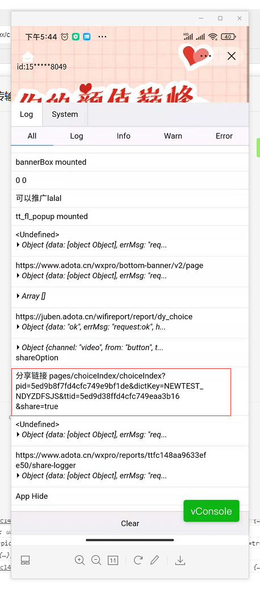

## 视频挂在组件使用手册
### 源码目录
>d-name/components/dio-share/dio-share.vue
### 使用场景
我们的业务方式尉cpm，即抖音视频创作达人，通过在自己的视频作品上挂载上我们的小程序，达人可以具体选择那款产品
，当作品发布成功之后，抖音会给流量到视频，浏览视频的用户，通过链接进入小程序后，完成趣味问答，为了获取结果
需要观看视频广告，抖音会依据特定的算法给小程序作者（我司）发放奖励。我们会拿出90%的收益分给视频创作者。    
### 使用方式
在产品的index页面，即用户进入的某一产品的第一个页面。（或者称为产品详情页面）添加`<dio-share></dio-share>`
因为组件为dio开头，符合`easycom`自动引入配置规则，详细配置可在` pages.json easycom`看到。
```json
"easycom": {
    "autoscan": true,
    "custom": {
        "uni-(.*)": "@/components/uni-$1/uni-$1.vue", // 匹配components目录内的vue文件
        "vue-file-(.*)": "packageName/path/to/vue-file-$1.vue", // 匹配node_modules内的vue文件
        "dio-(.*)": "@/components/dio-$1/dio-$1.vue"
    }
}
```
所以不需要在需要引用的页面，手动引入（`import dioShare from 'dio-share'`），正确方式如下
```html
<template>
    ...
   <dio-share></dio-share>
    ...
</template>
   
```
另外需要添加，分享事件处理回调函数，如下
```javascript
import {
        loggerShare,
        shareParam,
    } from '../../common/tt.mini.js';
export default{
        // ... 其他代码
        onShareAppMessage: function(shareOption) {
            let shareparam = shareParam(shareOption);
            loggerShare();
            console.log(shareparam);
            return shareparam;
        }
        // ... 其他代码
}
```
添加完成之后可以需要验证是否生效（步骤没错大概率不会出问题）。由于抖音开发工具2.0.6 自身问题不会接受路劲传入参数
验证是否生效需要通过预览，打开开发者模式，在vconsole中查看点击分享之后的输出


### 源码解析
全局状态变量 `threadId`为当前推广达人的用户ID。
```html
<template>
	<view>
        <button v-if="threadId && !tt_lite" @longtap="copyThreadId"  class="share_button" :style="{top:top+'rpx'}"  open-type="share"  data-channel="video">
            <image style="width: 24.3rpx;height: 27.78rpx;flex-shrink: 0;" src="/static/Dou.png" class="rotate-animation"></image>
            <text style="padding-left: 4rpx;color: #FFFFFF;">拍视频</text>
        </button>
	</view>
</template>

<script>
    import { mapMutations, mapState } from 'vuex';
    import {config} from '@/common/lib/app.js'
	export default {
		data() {
			return {
				
			};
		},
        props:{
            top: {
            	type: Number,
                default:250
            }
        },
		mounted() {
			if(this.threadId ){
				console.log('可以推广lalal');
			}
		},
        computed:{
            ...mapState(['threadId','tt_lite'])
        },
        methods: {
			...mapMutations(['setState']),
            copyThreadId(){
              console.log('copy threadId:'+config.threadId)
              uni.setClipboardData({
                  data:config.threadId,
                  success:function(){
                      uni.showToast({
                          title:'复制推广位成功!'
                      })
                  },
                  fail:function(){
                      uni.showToast({
                          title:'复制失败!'
                      })
                  }
              })  
            }
        },
	}
</script>

<style>
.share_button{
      white-space: nowrap;
      font-size: 24rpx;
      color: #ffffff;
      line-height: 42rpx;
      margin: 0;
      border: none;
      background-color: #000000;
      border-radius: 180rpx 0px 0px 180rpx;
      opacity: 0.8;
      width: 120rpx;
      height: 42rpx;
      position: fixed;
      /* top: 250rpx; */
      right: 0rpx;
      display: flex;
      align-items: center;
      padding:0 6rpx 0 14rpx;
	  z-index: 999;
  }
.rotate-animation{
    animation: rnimation 0.3s linear infinite alternate;
}
@keyframes rnimation{
    from{
        transform: rotate(330deg);
    }
    to{
        transform: rotate(370deg);
    }
}
</style>

```
